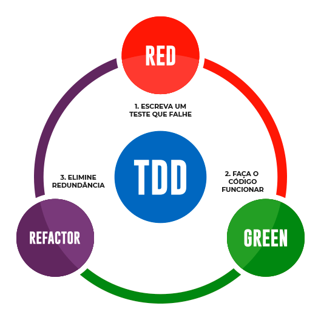
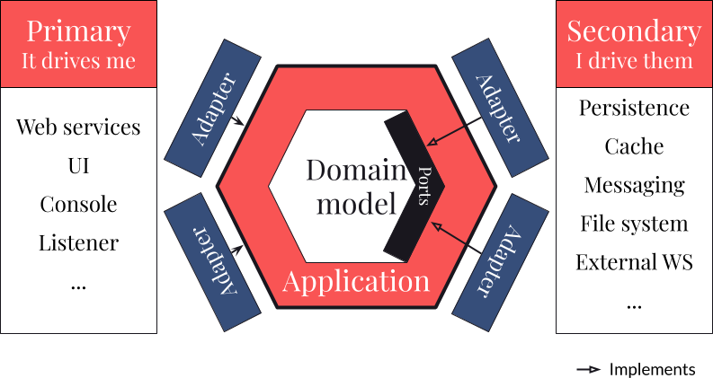
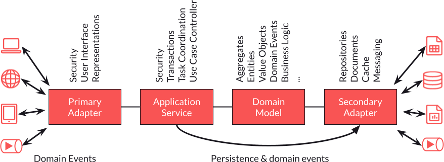
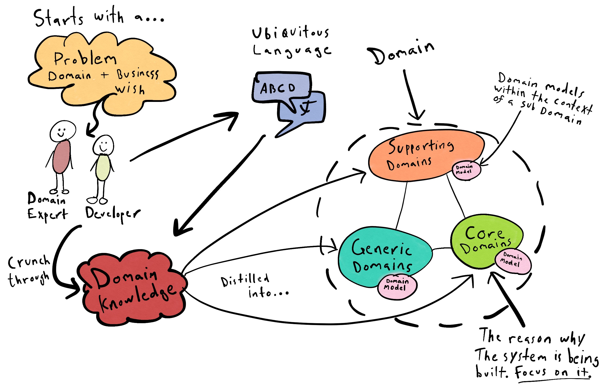
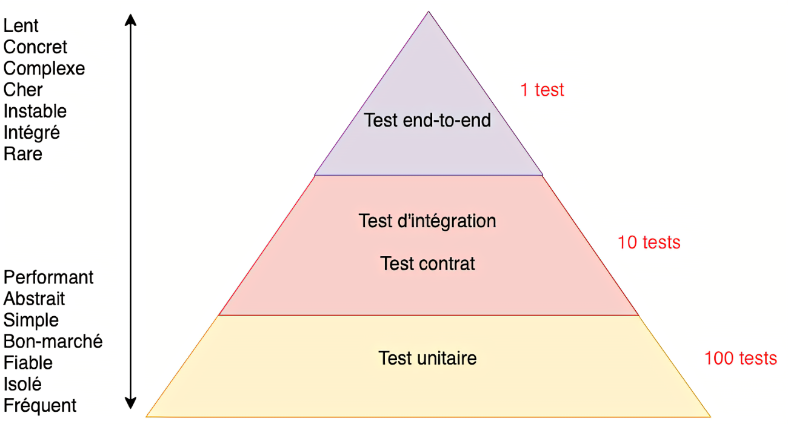

# Booking Car

Au travers d'un projet de démonstration, j'ai essayé d'implémenter des techniques provenant de la mouvance
Craftsmanship.

Qui arrive vraiment à faire du TDD au quotidien ? Si votre réponse est non, j'espère que cet article vous éclairera dans
cette démarche.

## Pourquoi faire du TDD ? ##

J'adore [cette séquence de Uncle Bob](https://www.youtube.com/watch?v=is41fgDrqn0) qui présente de façon imagée le TDD.

Lorsqu'on arrive sur un nouveau projet, qui n'a pas rêvé d'avoir un bouton avec un voyant sur lequel on peut appuyer à
tout moment pour vérifier que tout le code fonctionne ? Je refactore le code, "j'appuie" sur le bouton, le voyant est
vert ? Ok, je peux continuer mon refactor ...

Et bien ce bouton, c'est à vous de le construire, il faut même le construire avant même de commencer l'implémentation de
votre fonctionnalité.

Dans **TDD**, il y a le mot **Driven**, les tests ne servent pas à tester votre code, ils servent à **guider** vos
développements et permettent de vous poser à chaque fois cette question : "quelle fonctionnalité / RG je souhaite
maintenant implémenter ?"

Il y a 3 étapes lorsqu'on fait du TDD :

- le test échoue
- on fait l'implémentation uniquement nécessaire à la réussite du test et on passe le test au vert
- on refactore le code



## Architecture ##

Ce projet est découpé en 3 modules principaux + 1 d'outillage :

- **application** : orchestre les cas d'utilisation, gère les transactions et autorisations.
- **domain** : contient le modèle et la logique métier
- **infrastructure** : contient tous les frameworks techniques et les implémentations pour faire la persistance,
  messaging, REST, ...



La communication entre ces différentes couches est réalisée grâce à :

- **ports** : ce sont les contrats d'interfaces présents dans le domaine permettant de communiquer vers l'extérieur
- **adapters** : ce sont les classes d'implémentations des ports, présentes dans la couche infrastructure, qui sont
  injectées au démarrage du serveur. Ils peuvent être primaires (entrée) et secondaires (sortie).



Vous trouverez plus d'informations
dans [ce très bon article de Colin Damon.](https://blog.ippon.fr/2021/02/17/spring-boot-hexagone/)

## DDD ##

Je ne vais pas rappeler ce qu'est le **Domain Driven Design**, il y a de nombreux livres qui en parlent.

Je résumerais juste en disant que c'est un ensemble d'outils / patterns tactiques aidant le métier à exprimer tous les
concepts / fonctionnalités / règles qui composent l'application.

Une fois tous ces concepts posés, il serait dommage que le code ne reprenne pas les mêmes termes, la même organisation,
exprimés par les métiers. Nous faisons des applications pour répondre à des problématiques métiers, un développeur se
doit de s'intéresser d'abord au métier sinon il est sûr de ne pas répondre aux besoins. La technique n'est qu'un support
pour faire communiquer votre code métier avec le SI.

Si vous faites un nuage de mots sur la couche Domain et qu'il en ressort essentiellement de termes techniques, c'est que
vous avez sûrement raté quelque chose.



C'est pour cela que dans la couche **Domain**, vous ne retrouverez que des termes qui parlent au métier, pas de
suffixe _Service_ ou _Repository_ ou de découpage en package services, models, ... qui sont techniques. Les
regroupements de classes seront plutôt regroupées par périmètre fonctionnel. N'ayez pas peur de mélanger dans un même
package une entité, un service, une exception.

Par exemple :

```
- domain
   | - cars
   |   | - Car
   |   | - CarCategory 
   |   | - CarsNotFoundException
   |   | - CarStore

```

Afin d'aider le développeur à la compréhension du rôle au sens _DDD_ d'une classe, j'utiliserai plutôt des annotations "
maisons" : par exemple _@DomainService, @DomainEntity_, ....

## Les tests unitaires ##

### Principe ###

Dans la pyramide des tests, ce sont les plus nombreux, ils doivent couvrir toutes les fonctionnalités et règles métiers.
Ils se retrouvent dans les couches **Application** et **Domain**.



Un test unitaire doit être **F**ast **I**ndependent **R**epeatable **S**elf-validating **T**hourough. Si on se penche
plus particulièrement sur **F**ast, il faut bien comprendre qu'un développeur ne lancera pas, et donc n'écrira pas, de
tests unitaires s'il lui faut attendre plusieurs secondes pour les exécuter.

Et pour qu'ils soient rapides à s'exécuter, ils doivent s'abstraire de tous les frameworks techniques consommateurs en
temps de montage.

### Quoi tester ? ###

Une question importante qu'il faut se poser : que doit tester mon test unitaire ? Si vous vous dites que c'est une seule
méthode d'une classe en particulier et que le reste doit être mocké, c'est que vous testez la collaboration entre
différentes classes (London School).

Le gros inconvénient de cette méthode est que cela va vous empêcher de refactorer votre code sans avoir besoin de
retoucher à un ou plusieurs tests. Pourtant, on refactore pour rendre le code plus _maintenable_, _évolutif_, ... pas
pour changer la règle de gestion testée.

De ce constat, un test unitaire doit plutôt tester un comportement attendu, le résultat final, peu importe le moyen, le
nombre de classes utilisées pour donner ce résultat. Afin de s'abstraire de la technique, on utilise des Stubs pour
avoir une implémentation des _Ports_ lors de l'exécution des tests.

De cette manière, on peut vraiment faire du TDD dans les règles de l'art, on refactore sans casser les tests et on a
plus forcément besoin de tester une méthode d'une classe en particulier à partir du moment où elle est testée au travers
d'autres tests sur d'autres méthodes.

Ayez confiance aux autres classes que vous utilisez, même si vous ne les avez pas écrites, votre test unitaire doit
traverser toutes les classes nécessaires à la fonctionnalité testée en s'arrêtant avant la couche _Infrastructure_.

Les tests unitaires vont ainsi majoritairement se situer aux bords de l'hexagone.


### Par quoi commencer ? ###

Vous avez une nouvelle fonctionnalité à développer et vous ne savez pas comment commencer ?

- commencez par écrire une classe de test, peu importe son nom si vous n'avez pas encore en tête l'implémentation.
- écrivez une 1ère méthode de test en décrivant le cas le plus simple de la fonctionnalité
- l'annotation @DisplayName permet de documenter proprement vos tests. Finalement, **vos tests unitaires seront vos
  spécifications fonctionnelles**. Un nouvel arrivant sur le projet doit pouvoir connaitre les règles de gestion
  implémentées en exécutant juste les tests unitaires.
- imaginez les classes / méthodes à utiliser dans le test même si elles n'existent pas encore.

```java
class MyTest {
    private FizzBuzz fizzBuzz = new FizzBuzz();

    @Test
    @DisplayName("Fizzbuzz of 1 is 1")
    void fibuzz_of_1_is_1() {
        assertThat(fizzBuzz.of(1)).isEqualTo("1");
    }
}
```

- créer les classes / méthodes nécessaires au test
- lancer le test → _rouge_
- implémentez le minimum pour réussir le test
- lancer le test → _vert_
- _refactorez_ ci nécessaire
- écrivez un nouveau test qui défini un nouveau cas que doit couvrir la fonctionnalité
- ...

## Les tests d'acceptances - BDD ##

### Pourquoi faire ? ###

Le **B**ehaviour **D**riven **D**evelopment est une pratique de développement permettant d'être guidée afin de
découvrir, aux travers des tests, le modèle métier et les services à créer.

Ce guide est un fichier **Gherkin**, écrit en français avec le métier, décrivant les données manipulées et les scénarios
des différentes fonctionnalités.

Il est très important de décrire des jeux de données sur chaque scénario, cela aide à la compréhension aussi bien du
développeur que du métier, et cela permet de bien clarifier le comportement attendu.


### Quand en faire ? ###

Certains diront qu'ils ont l'impression d'écrire les mêmes tests lorsqu'ils écrivent des tests d'acceptance et des tests
unitaires. C'est vrai, sauf que l'objectif n'est pas le même :

- les tests unitaires vont expliciter toutes les règles de gestion
- les tests acceptances vont définir un contrat entre le développeur et le métier en explicitant des cas passants.

Écrire des tests acceptances peut être assez chronophage avec le Gherkin et Cucumber. C'est pourquoi, il vaut mieux les
réserver aux domaines (au sens DDD) ayant les plus forts enjeux et complexité métiers.

## Les tests d'intégrations ##

Les tests d'intégrations permettent de vérifier que l'intégration avec le framework fonctionne correctement. Ils sont
situés, de ce fait, dans la couche infrastructure.

### Persistence des données ###

Dans le domaine, j'ai utilisé des **Fakes** pour persister les données. Ce n'est bien sûr pas une solution viable pour
une application en production mais cela peut, tout de même, être util en début de projet lorsque le choix du système de
base de données n'est pas statué.

#### Adapters ####

Une fois la techno définie, des **adapters** implémentant les **ports secondaires** du domaine vont être nécessaires
pour faire le lien avec le framework de persistence. Dans cet exemple, j'utilise Spring JPA et une base de données
PostgreSQL.

L'adapter a pour rôle :

- d'implémenter le comportement attendu par le domaine pour gérer les données persistées
- de transformer les objets du domaine en objet de persistence (_Entity_)


#### TestContainers ####

Pour lancer les tests d'intégrations, nous avons besoin d'une base de données PostgreSQL de test.
J'utilise [TestContainers](https://www.testcontainers.org/) qui me permet de monter, pendant la phase de tests, un
conteneur basé sur une image PostgreSQL avec la version attendue.

La classe de
configuration [PostgresqlContainerConfiguration](/bookingcar-infrastructure/src/test/java/bco/bookingcar/infrastructure/secondary/configuration/PostgresqlContainerConfiguration.java)
réalise cette opération et chaque classe de test, qui en a besoin, importe cette configuration.

Par exemple :

`````java

@SpringBootTest
@Import(PostgresqlContainerConfiguration.class)
public class StoreCarsAdapterIT {
    // ...
}
`````

### Exposition d'API ###

Le but est de tester que la définition des controllers et le mapping des entrées / sorties fonctionnent correctement,
pas les règles métiers. Pour ce faire, j'utilise une nouvelle fois des **Fakes** qui vont simuler le comportement des
services métiers, une solution pourrait être d'utiliser des **Mocks**.

Les Fakes sont injectés dans la classe de configuration utilisée uniquement pour les
tests [ApplicationConfigurationTest](/bookingcar-infrastructure/src/test/java/bco/bookingcar/infrastructure/primary/configuration/ApplicationConfigurationTest.java)
.

Les tests d'intégrations des controllers sont réalisés grâce au framework **MockMvc**.

## Les tests end to end ##

## Les tests d'architectures ##

### Domain ###

L'importance des invariants dans le modèle métier.


